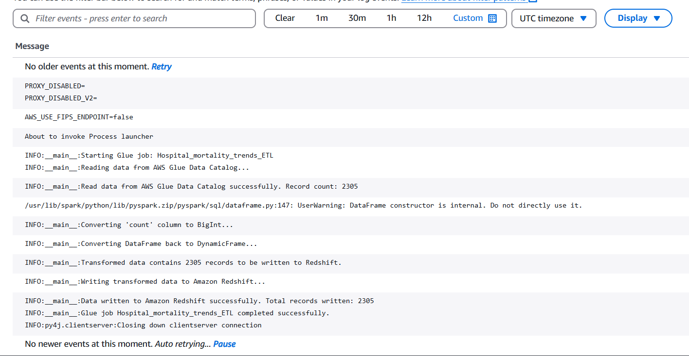
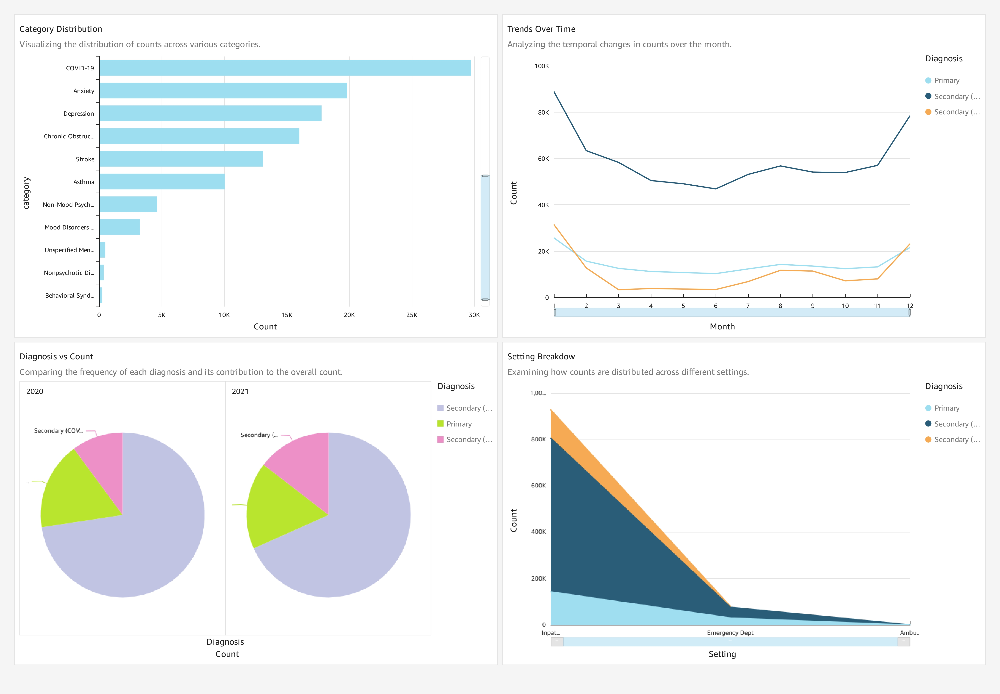

# Disclaimer

This project uses sample healthcare data sourced from publicly available datasets on [Data.gov](https://www.data.gov/). The data does not contain any **Personally Identifiable Information (PII)** or **Protected Health Information (PHI)** and is compliant with **HIPAA** and other relevant regulations.

This project is intended solely for educational and demonstration purposes, showcasing how AWS services can be used for data analytics and visualization. It is not intended for production use or handling real-world sensitive healthcare data. Users are responsible for ensuring compliance with all applicable laws and regulations when using similar workflows with actual data.

---
# Healthcare Data Analysis with AWS

This project demonstrates how to use AWS services to analyze data and create visualizations. The project walks through the process of uploading healthcare-related data to Amazon S3, cataloging the data with AWS Glue Crawler, storing metadata in AWS Glue Data Catalog, loading data into Amazon Redshift, and visualizing the data using Amazon QuickSight.

By using real healthcare data, this project highlights how AWS services can work together to streamline data processing, warehousing, and visualization, enabling better insights and decision-making.
he workflow includes:
- **Amazon S3** (for data storage)
- **AWS Glue Crawler** (for discovering schema)
- **AWS Glue Data Catalog** (for storing metadata)
- **Amazon Redshift** (for data warehousing)
- **Amazon QuickSight** (for data visualization)

---

## Prerequisites

- AWS Account with appropriate IAM roles/permissions for services like **S3**, **Glue**, **Redshift**, and **QuickSight**.
- Basic knowledge of AWS services like **S3**, **Redshift**, and **QuickSight**.
- Sample healthcare data (CSV format) for this analysis. You can use the sample data provided on **data.gov**.

---

## Table of Contents

1. [Sample Data Source](#sample-data-source)
2. [Architecture Diagram](#architecture-diagram)
3. [Uploading Sample Data to S3](#uploading-sample-data-to-s3)
4. [Creating AWS Glue Crawler](#creating-aws-glue-crawler)
5. [Creating Redshift Table from Glue Data Catalog](#creating-redshift-table-from-glue-data-catalog)
6. [Creating ETL Jobs in AWS Glue](#creating-etl-jobs-in-aws-glue)
7. [Testing Data in Redshift](#testing-data-in-redshift)
8. [Visualizing Data in Amazon QuickSight](#visualizing-data-in-amazon-quicksight)
9. [Screenshots and Outputs](#screenshots-and-outputs)

---

## 1. Sample Data Source

You can download sample healthcare data from the following link on **data.gov**:

- [Healthcare Mortality Data - Data.gov](https://catalog.data.gov/dataset/effects-of-covid-19-on-hospital-utilization-trends-636d2)

This dataset contains in-hospital mortality trends by diagnosis type and other key healthcare metrics.

---

## 2. Architecture Diagram

The architecture below illustrates how the data flows through AWS services from storage to visualization:


---

## 3. Uploading Sample Data to S3

1. Navigate to the **S3** dashboard in the AWS Management Console.
2. Create a new S3 bucket, for example, `healthcare-data-bucket`.
3. Upload your sample healthcare data (CSV file) into the bucket.
4. Ensure that the file is accessible for use by other AWS services.

---

## 4. Creating AWS Glue Crawler

1. Open the **AWS Glue Console** and navigate to **Crawlers**.
2. Click **Add crawler** and provide a name (e.g., `healthcare-data-crawler`).
3. In the **Data store** section, choose **S3** and specify the location where your data is stored (`s3://healthcare-data-bucket/`).
4. Choose **Crawl data in this data store** and set the **Crawler output** to create a table in the **Glue Data Catalog**.
5. Choose the IAM role that has permissions to access the data in S3 and create tables in Glue.
6. Set up **Crawler schedule** (optional) to run the crawler periodically if new data is added.
7. Run the crawler to discover the schema of your CSV file and create a table in the Glue Data Catalog.

---

## 5. Creating Redshift Table from Glue Data Catalog

1. In the **AWS Redshift Console**, create a Redshift cluster (if not already created).
2. Once your cluster is active, go to the **Query Editor** in Redshift.
3. Using the schema generated by the Glue Crawler, create a corresponding table in Redshift
4. Verify the table creation by running the following query:

```sql
SELECT * FROM public.table_name LIMIT 100;
```

---

## 6. Creating ETL Jobs in AWS Glue

1. Navigate to **AWS Glue Console** and go to **ETL Jobs**.
2. Click **ETL Job** to create an ETL job.
3. Set the source as your Glue Data Catalog table.
4. Set the destination as the Redshift table you just created.
5. Configure the **transformation** (if needed) using the Glue script editor. For example, you might want to perform basic data cleansing, such as type casting or handling null values.
6. Define the **IAM role** to give Glue access to Redshift and S3.
7. Save and run the job to load data from S3 (via Glue Data Catalog) into Redshift.

---

## 7. Testing Data in Redshift

Once the ETL job has successfully run, you can test the loaded data in Redshift:

1. Open the **Query Editor** in the Redshift Console.
2. Run the following SQL queries to verify the data was successfully loaded:

   - **To get the total row count for the table**:

   ```sql
   SELECT COUNT(*) AS total_rows
   FROM public.table_name;
   ```

   - **Retrieve the top 100 records**:

   ```sql
   SELECT * FROM public.table_name LIMIT 100;
   ```

---

## 8. Visualizing Data in Amazon QuickSight

1. Open the **Amazon QuickSight Console** and choose **Datasets**.
2. Choose **New Dataset** and select **Redshift** as the data source.
3. Enter the required **Redshift cluster details**, such as **Data source name**, **Connection type**, **Database server**, **Port**, **Database name**, and  etc.
4. Choose the **table** (`public.table_name`) from your Redshift database.
5. Click **Select** to load the data into QuickSight.
6. Create visualizations using the data:
    - **Bar Charts**
    - **Line/Area Charts**
    - **Pie/Bar Charts**

7. Build an interactive **Dashboard** in QuickSight that allows users to explore the healthcare data visually.

---

## 9. Screenshots and Outputs

### Sample ETL Job Run CloudWatch Log Output

*CloudWatch logs showing the progress and success of the ETL job.* 

 

---

### Sample Testing Redshift Query Output Result

*Run the following query in Redshift to verify the data has been loaded correctly*

```sql
SELECT * FROM public.in_hospital_mortality_trends_by_diagnosis_type_csv LIMIT 100;;
```
 

---

### QuickSight Dashboard Screenshot

*The Amazon QuickSight Dashboard visualizations.*

 

---

## Conclusion

With this setup, you’ve successfully uploaded healthcare data to **S3**, processed it using **AWS Glue Crawler** and **ETL jobs**, loaded it into **Redshift**, and visualized it in **Amazon QuickSight**. This solution enables easy analysis of healthcare trends and provides interactive visualizations for users to explore.

---

### Additional Notes

- Ensure all IAM roles have the correct permissions to access the necessary AWS resources (S3, Glue, Redshift, QuickSight).
- The data can be regularly updated by re-running the Glue Crawler and ETL jobs.
- Consider setting up data refresh schedules in QuickSight to keep the dashboard up to date.

---

## Notes  

⚠️ **Important Reminder**:  
"Because we all love the thrill of an unexpected AWS bill, don't forget to *not* delete your created services after testing. Who doesn't enjoy explaining a hefty cloud bill to their manager? But hey, if you're into that sort of thing, go ahead and leave it running. 😉" 

---

## License
This project is licensed under the MIT License.
